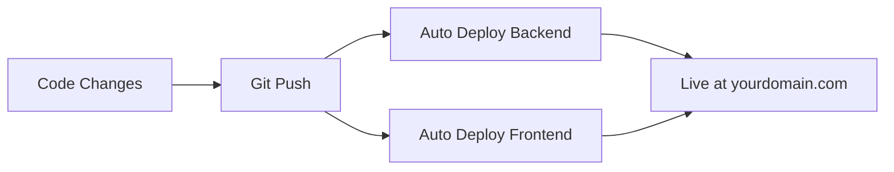

# 🚀 **RECOMMENDED DEPLOYMENT PLAN - KALM AI Platform**

## 📊 **My Top Recommendation: The "Startup Stack"**

### **🎯 Why This Stack?**
- ✅ **Cost-Effective**: ~$25-35/month total
- ✅ **Lightning Fast**: Global CDN + optimized hosting
- ✅ **Zero DevOps**: Deploy with git push
- ✅ **Auto-Scaling**: Handles traffic spikes automatically
- ✅ **Professional**: Enterprise-grade infrastructure

---

## 🌟 **THE RECOMMENDED STACK**

### **1. Frontend → Vercel (FREE)**
- **Why**: Built for React/Vite, lightning fast
- **Cost**: $0 (hobbyist plan)
- **Features**: Auto-deployments, global CDN, custom domain
- **Deploy**: Connect GitHub → automatic deployments

### **2. Backend → Railway ($5-10/month)**
- **Why**: Excellent for Node.js, simple deployment
- **Cost**: $5-10/month (usage-based)
- **Features**: Auto-deploy, environment variables, monitoring
- **Alternative**: Render ($7/month)

### **3. Database → MongoDB Atlas (ALREADY SET UP)**
- **Cost**: $0 (current free tier)
- **Status**: ✅ Already configured and working

### **4. Domain → Cloudflare (FREE)**
- **Why**: Free DNS, security, performance
- **Cost**: $0 (DNS + basic security)
- **Features**: SSL, DDoS protection, caching

---

## 🚀 **DEPLOYMENT STEPS**

### **Step 1: Prepare for Production**
```bash
# Frontend environment variables
VITE_API_URL=https://your-backend.railway.app
VITE_STRIPE_PUBLISHABLE_KEY=pk_live_...

# Backend environment variables
NODE_ENV=production
MONGODB_URI=mongodb+srv://... (your existing Atlas connection)
JWT_SECRET=your-super-secure-production-secret
STRIPE_SECRET_KEY=sk_live_...
EMAIL_USER=your-email@domain.com
EMAIL_APP_PASSWORD=your-app-password
```

### **Step 2: Deploy Backend (Railway)**
1. **Sign up**: railway.app
2. **Connect GitHub** repository
3. **Deploy** ai-sales-platform/server
4. **Add environment variables** in Railway dashboard
5. **Get your backend URL**: `https://your-app.railway.app`

### **Step 3: Deploy Frontend (Vercel)**
1. **Sign up**: vercel.com
2. **Import project** from GitHub
3. **Set build settings**:
   - Framework: Vite
   - Root Directory: `ai-sales-platform/client`
   - Build Command: `npm run build`
4. **Add environment variables**
5. **Deploy** → Get URL: `https://your-app.vercel.app`

### **Step 4: Configure Custom Domain**
1. **Add domain to Vercel** (for frontend)
2. **Point DNS to Vercel**:
   - A record: `185.199.108.153`
   - AAAA record: `2606:50c0:8000::153`
3. **SSL Certificate**: Auto-generated by Vercel

---

## 💰 **COST BREAKDOWN**

| Service | Cost | What You Get |
|---------|------|--------------|
| **Vercel** | $0 | Frontend hosting, CDN, SSL |
| **Railway** | $5-10/month | Backend hosting, auto-deploy |
| **MongoDB Atlas** | $0 | Database (current plan) |
| **Cloudflare** | $0 | DNS, security, performance |
| **Domain** | $8-12/year | Your custom domain |
| **TOTAL** | **~$25-35/month** | Professional platform |

---

## ⚡ **QUICK START DEPLOYMENT**

### **Option A: Full Automatic (Recommended)**
```bash
# 1. Push your code to GitHub
git add .
git commit -m "Ready for production deployment"
git push origin main

# 2. Deploy backend to Railway (5 minutes)
# - Connect GitHub repo
# - Deploy ai-sales-platform/server folder
# - Add environment variables

# 3. Deploy frontend to Vercel (3 minutes)
# - Connect GitHub repo  
# - Deploy ai-sales-platform/client folder
# - Add environment variables

# 4. Configure domain (2 minutes)
# - Point domain to Vercel
# - SSL auto-configured
```

### **Your Platform Will Be Live**: `https://yourdomain.com` 🎉

---

## 🛡️ **PRODUCTION CHECKLIST**

### **Security**
- ✅ Change JWT_SECRET to production value
- ✅ Use Stripe live keys (when ready)
- ✅ Configure CORS for production domains
- ✅ Enable rate limiting (already configured)

### **Performance**
- ✅ Enable production optimizations
- ✅ Configure CDN caching
- ✅ Optimize images and assets
- ✅ Enable compression

### **Monitoring**
- ✅ Set up error tracking
- ✅ Monitor API response times
- ✅ Track payment success rates
- ✅ Monitor user registrations

---

## 🔄 **DEPLOYMENT WORKFLOW**



**Once Set Up**: Every `git push` automatically deploys your changes! 🚀

---

## 🆘 **ALTERNATIVE STACKS**

### **Budget Option (~$15/month)**
- Frontend: Netlify (free)
- Backend: Render ($7/month)
- Database: MongoDB Atlas (free)

### **Enterprise Option (~$50/month)**
- Frontend: Vercel Pro ($20/month)
- Backend: Railway Pro ($20/month)
- Database: MongoDB Atlas M10 ($10/month)

---

## 🎯 **WHAT HAPPENS NEXT?**

1. **Choose your domain name** (if not already chosen)
2. **Set up Railway account** (backend hosting)
3. **Set up Vercel account** (frontend hosting)
4. **I'll guide you through each step** 
5. **Your platform goes live** in ~30 minutes! 🚀

**Ready to deploy?** Let me know your domain name and I'll create the step-by-step deployment guide! 